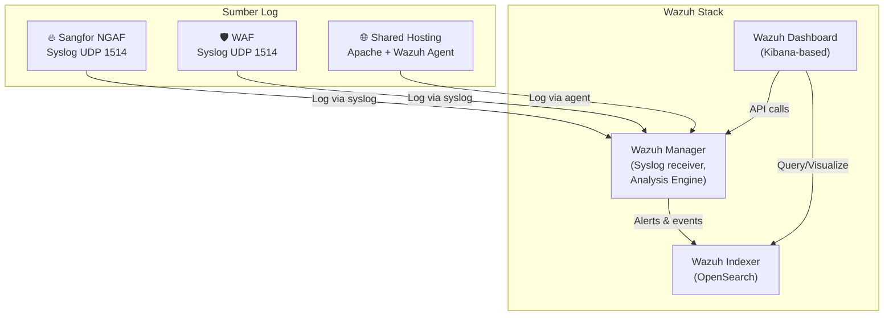

# Wazuh SOC Lab

Lab belajar **Wazuh** (SIEM & XDR) untuk praktik monitoring keamanan.  
Simulasi pengumpulan log dari **Sangfor NGAF**, **Web Application Firewall (WAF)**, dan **server shared hosting** multi-domain — semuanya berjalan dalam satu Docker Compose.

[](https://wazuh.com)
[](https://docs.docker.com/compose/)
[](LICENSE)

---

## 📋 Daftar Isi

- [Arsitektur](#-arsitektur)
- [Struktur Folder](#-struktur-folder)
- [Persyaratan](#-persyaratan)
- [Cara Menjalankan](#-cara-menjalankan)
- [Konfigurasi & Kustomisasi](#-konfigurasi--kustomisasi)
- [Mengirim Log Uji](#-mengirim-log-uji)
- [Belajar Membaca Log](#-belajar-membaca-log)
- [Lisensi](#-lisensi)

---

## 🏗 Arsitektur



**Aliran data:**

1. **Sangfor NGAF** dan **WAF** mengirim log mentah ke Wazuh Manager melalui **syslog UDP** (port 1514).
2. **Container shared hosting** menjalankan Apache + Wazuh Agent. Agent membaca file `access.log` dan `error.log` lalu mengirim ke Manager.
3. Manager menganalisis log menggunakan **decoder** dan **rule** (termasuk custom decoder untuk Sangfor/WAF), menghasilkan alert.
4. Alert disimpan di **Wazuh Indexer** (OpenSearch).
5. **Wazuh Dashboard** menampilkan visualisasi dan memungkinkan pencarian log interaktif.

---

## 📁 Struktur Folder

```
.
├── config/
│   ├── wazuh_indexer_ssl_certs/   # Sertifikat SSL (hasil generate)
│   └── wazuh_manager/
│       ├── local_decoder.xml      # Custom decoder Sangfor/WAF
│       ├── local_rules.xml        # Custom rule alerts
│       └── ossec.conf             # Konfigurasi Manager (syslog receiver)
├── docker-compose.yml             # Stack Wazuh + Shared Hosting
├── Dockerfile.shared              # Image simulasi shared hosting
├── entrypoint.sh                  # Startup script container hosting
├── shared-hosting.conf            # Virtual host Apache
├── wazuh-agent-ossec.conf         # Konfigurasi Wazuh Agent di hosting
└── setup.sh                       # Script pembuat struktur folder (opsional)
```

---

## 🔧 Persyaratan

- **Docker Engine** ≥ 20.10
- **Docker Compose** ≥ v2 (plugin `docker compose`)
- RAM minimal **6 GB** (direkomendasikan 8 GB)
- Port yang tersedia:
  - `443` → Wazuh Dashboard
  - `1514/udp` → Syslog receiver
  - `8080` → Web shared hosting (opsional)

---

## 🚀 Cara Menjalankan

### 1. Clone repository

```bash
git clone https://github.com/usernamekamu/wazuh-soc-lab.git
cd wazuh-soc-lab
```

### 2. Generate Sertifikat SSL

Wazuh Indexer membutuhkan sertifikat untuk komunikasi terenkripsi.

```bash
# Clone repo Wazuh Docker (branch stabil)
cd /tmp
git clone https://github.com/wazuh/wazuh-docker.git -b v4.9.0
cd wazuh-docker/single-node

# Generate sertifikat
docker compose -f generate-indexer-certs.yml run --rm generator

# Salin hasilnya ke project ini
cp -r config/wazuh_indexer_ssl_certs/* \
    ~/Documents/code/sec/wazuh-belajar/config/wazuh_indexer_ssl_certs/
```

### 3. Bangun dan jalankan lab

```bash
cd ~/Documents/code/sec/wazuh-belajar   # atau path repo
docker compose up -d --build
```

Tunggu beberapa menit hingga semua container **healthy** (`docker compose ps`).

### 4. Akses layanan

- **Wazuh Dashboard**: [https://localhost](https://localhost)
  Username: `kibanaserver` / Password: `kibanaserver`
- **Shared Hosting (simulasi)**: [http://localhost:8080](http://localhost:8080)
  (Gunakan `curl -H 'Host: domain1.ac.id' http://localhost:8080` untuk mengakses domain spesifik)

---

## ⚙️ Konfigurasi & Kustomisasi

### Menambah Custom Decoder & Rule

Edit file di `config/wazuh_manager/`:

1. **`local_decoder.xml`** – definisikan cara mem-parse log mentah.
2. **`local_rules.xml`** – tentukan rule alert berdasarkan field hasil parsing.

Setelah mengedit, restart manager:

```bash
docker compose restart wazuh-manager
```

### Mengirim Log dari Perangkat Asli

Arahkan syslog perangkat Anda ke `<ip-host>:1514/udp`.
Contoh konfigurasi Sangfor NGAF:

```
Log server: <ip-host>
Port: 1514
Protokol: UDP
Format: syslog (RFC 3164/5424)
```

### Menambah Domain di Shared Hosting

Edit `shared-hosting.conf` dan `Dockerfile.shared` (tambah direktori), lalu rebuild:

```bash
docker compose up -d --build shared-hosting
```

---

## 📨 Mengirim Log Uji

Gunakan `netcat` untuk mengirim log syslog tiruan dari terminal:

```bash
# Log Sangfor NGAF
echo '<134>2026-06-21T10:15:30Z SangforNGAF devid=NGAF-01 src=192.168.1.100 dst=10.0.0.5 action=blocked policy="Block High Risk" type=web-attack severity=high' | nc -u -w0 localhost 1514

# Log WAF
echo '<131>2026-06-21T10:16:05Z WAF-01 src=172.16.0.10 dst=203.0.113.50 rule=SQLi method=GET uri=/login?id=1%27%20OR%20%271%27%3D%271 status=403' | nc -u -w0 localhost 1514
```

Log ini akan muncul di Dashboard setelah beberapa detik.

---

## 📖 Belajar Membaca Log

1. Buka **Wazuh Dashboard** → **Discover** (index pattern `wazuh-alerts-*`).
2. Cari event dari `rule.description` atau filter `agent.name: shared-hosting`.
3. Lihat field hasil parsing di `data.*` (misal `data.srcip`, `data.action`).
4. Buat visualisasi sederhana: grafik serangan per domain, top attacker IP, dll.

Contoh decoder Sangfor NGAF sudah tersedia di `local_decoder.xml`, bisa langsung digunakan.

---

## 📄 Lisensi

Proyek ini dilisensikan di bawah [MIT License](LICENSE) — bebas digunakan, dimodifikasi, dan didistribusikan.

---

**Selamat belajar!**
Jika ada pertanyaan, silakan buka [Issues](https://github.com/usernamekamu/wazuh-soc-lab/issues) atau kontak penulis.
