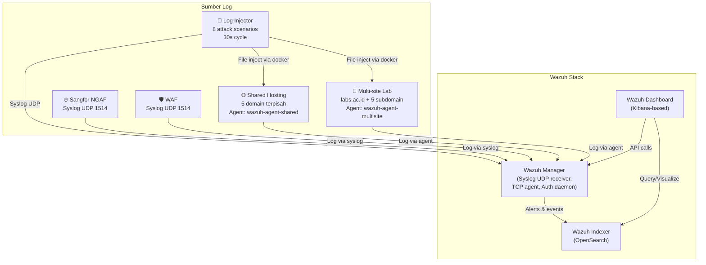

# Wazuh SOC Lab

Lab belajar **Wazuh** (SIEM & XDR) untuk praktik monitoring keamanan.  
Simulasi pengumpulan log dari **Sangfor NGAF**, **Web Application Firewall (WAF)**,  
**shared hosting** multi‑domain, dan **multi‑site lab universitas** — semuanya dalam satu Docker Compose.

[](https://wazuh.com)
[](https://docs.docker.com/compose/)
[](LICENSE)

---

## 📋 Daftar Isi

- [Arsitektur](#-arsitektur)
- [Struktur Folder](#-struktur-folder)
- [Persyaratan](#-persyaratan)
- [Cara Menjalankan](#-cara-menjalankan)
- [Konfigurasi & Kustomisasi](#-konfigurasi--kustomisasi)
- [Log Injector](#-log-injector)
- [Mengirim Log Uji](#-mengirim-log-uji)
- [Belajar Membaca Log](#-belajar-membaca-log)
- [Lisensi](#-lisensi)

---

## 🏗 Arsitektur



**Aliran data:**

1. **Log Injector** — container Alpine yang menjalankan orchestrator shell script. Setiap 30 detik inject log NORMAL, jeda, inject log ATTACK, jeda, ulang.
2. **Injector** menginjeksi file log ke container shared-hosting & multi-site via mounted `/var/run/docker.sock` + `docker exec`.
3. **Sangfor NGAF** dan **WAF** — injector mengirim log mentah ke Wazuh Manager via **syslog UDP** (port 1514) menggunakan `nc -u`.
4. **FIM (File Integrity Monitoring)** — injector membuat/memodifikasi file di agent container untuk trigger syscheck.
5. **Container shared hosting** menjalankan Apache + Wazuh Agent (terkoneksi via **TCP 1514**). Agent membaca log dari lima domain terpisah (`domain1.ac.id` … `domain5.ac.id`).
6. **Container multi‑site lab** mensimulasikan portal `labs.ac.id` dengan lima subdomain (prosman, keamanan, jaringan, web, data). Agent membaca satu access log gabungan (virtual host membedakan lewat `vhost`).
7. Manager menganalisis log menggunakan **decoder** dan **rule** (termasuk custom decoder untuk Sangfor/WAF), menghasilkan alert.
8. Alert disimpan di **Wazuh Indexer** (OpenSearch).
9. **Wazuh Dashboard** menampilkan visualisasi dan pencarian interaktif (port **5601**).
10. **Agent auto-registration:** Agent container mendaftar otomatis ke manager via REST API pada startup — tanpa perlu `docker exec` manual.

---

## 📁 Struktur Folder

```
.
├── config/
│   ├── wazuh_indexer/                 # Konfigurasi OpenSearch indexer
│   │   └── opensearch.yml
│   ├── wazuh_indexer_ssl_certs/       # Sertifikat SSL (hasil generate)
│   ├── wazuh_manager/
│   │   ├── local_decoder.xml          # Custom decoder Sangfor/WAF
│   │   ├── local_rules.xml            # Custom rule alerts
│   │   └── ossec.conf                 # Konfigurasi Manager (syslog receiver)
│   └── wazuh_dashboard/               # Konfigurasi OpenSearch Dashboards
│       └── opensearch_dashboards.yml
├── docs/                              # Studi SOC-200 & dokumentasi
│   └── STRUKTUR-FOLDER.md
├── scripts/
│   ├── orchestrator.sh                # Main entrypoint injector
│   ├── orchestrator.conf              # Timing, scenarios, intensity
│   ├── inject-common.sh               # Library functions inject
│   └── scenarios/
│       ├── web-recon.sh               # Directory busting + path traversal
│       ├── web-sqli.sh                # SQL injection payloads
│       ├── web-xss.sh                 # Reflected XSS payloads
│       ├── web-bruteforce.sh          # wp-login brute force
│       ├── ssh-brute.sh               # SSH brute + post-exploit sudo
│       ├── sangfor-logs.sh            # Sangfor NGAF syslog UDP
│       ├── waf-logs.sh                # WAF syslog UDP
│       └── fim-webshell.sh            # Webshell file create + FIM trigger
├── docker-compose.yml                 # Orkestrasi semua service
├── Dockerfile.injector                # Image injector (Alpine + docker-cli)
├── Dockerfile.shared                  # Image shared hosting (5 domain)
├── Dockerfile.multi-site              # Image multi‑site (labs.ac.id)
├── entrypoint.sh                      # Startup script multi-site
├── entrypoint-wordpress.sh            # Startup script shared hosting (auto DB + WP)
├── register-agent.sh                  # Auto‑register agent via Wazuh API
├── setup.sh                           # Setup awal environment
├── shared-hosting.conf                # VirtualHost Apache untuk shared hosting
├── multi-site.conf                    # VirtualHost Apache untuk multi‑site
├── wazuh-agent-shared.conf            # Konfigurasi agent untuk shared hosting
├── wazuh-agent-multisite.conf         # Konfigurasi agent untuk multi‑site
├── wazuh-agent-ossec.conf             # Konfigurasi agent alternatif
└── README.md
```

---

## 🔧 Persyaratan

- **Docker Engine** ≥ 20.10
- **`docker-compose`** (standalone binary, bukan plugin `docker compose`)
- RAM minimal **6 GB** (direkomendasikan 8 GB)
- Port yang tersedia:
  - `5601` → Wazuh Dashboard (HTTPS)
  - `1514/udp` → Syslog receiver
  - `1514/tcp` → Agent connection (secure)
  - `7070` → Shared hosting (multi‑domain)
  - `7071` → Multi‑site lab

---

## 🚀 Cara Menjalankan

### 1. Clone repository

```bash
git clone https://github.com/yogiex/wazuh-soc-lab.git
cd wazuh-soc-lab
```

### 2. Generate Sertifikat SSL

Sertifikat SSL sudah tersedia di `config/wazuh_indexer_ssl_certs/`.  
Untuk membuat ulang dari awal:

```bash
cd /tmp
git clone https://github.com/wazuh/wazuh-docker.git -b v4.14.5
cd wazuh-docker/single-node

docker-compose -f generate-indexer-certs.yml run --rm generator

# Salin ke folder proyek
cp -r config/wazuh_indexer_ssl_certs/* \
    ~/Documents/code/sec/wazuh-belajar/config/wazuh_indexer_ssl_certs/
```

### 3. Bangun dan jalankan lab

```bash
cd ~/Documents/code/sec/wazuh-belajar   # atau path repo
docker-compose up -d --build
```

Tunggu beberapa menit hingga semua container **healthy** (`docker-compose ps`).

### 4. Akses layanan

- **Wazuh Dashboard**: [https://localhost:5601](https://localhost:5601)
  Username: `kibanaserver` / Password: `kibanaserver`

- **Shared Hosting** (5 domain terpisah):
  Akses via `curl` dengan header `Host`:

  ```bash
  curl -H "Host: domain1.ac.id" http://localhost:7070
  curl -H "Host: domain2.ac.id" http://localhost:7070
  # … s.d. domain5.ac.id
  ```

- **Multi‑site Lab** (labs.ac.id & subdomain):
  ```bash
  curl -H "Host: labs.ac.id" http://localhost:7071
  curl -H "Host: prosman.labs.ac.id" http://localhost:7071
  curl -H "Host: keamanan.labs.ac.id" http://localhost:7071
  # … s.d. data.labs.ac.id
  ```

---

## ⚙️ Konfigurasi & Kustomisasi

### Custom Decoder & Rule (Sangfor NGAF & WAF)

Dua decoder sudah tersedia di `config/wazuh_manager/local_decoder.xml`:

| Decoder | Pemetaan Field |
|---------|---------------|
| **Sangfor NGAF** | `devid`, `srcip`, `dstip`, `ngaf_action`, `policy`, `type`, `severity` |
| **WAF** | `srcip`, `dstip`, `rule`, `method`, `uri`, `waf_status` |

10 rules siap pakai di `local_rules.xml` (ID 100002–100005 Sangfor, 100010–100015 WAF).

### Menambah Custom Decoder & Rule Baru

Edit file di `config/wazuh_manager/`:

1. **`local_decoder.xml`** – definisikan cara mem-parse log mentah.
2. **`local_rules.xml`** – tentukan rule alert berdasarkan field hasil parsing.

> **⚠️ Reserved words:** Jangan gunakan `action`, `status`, atau `type` sebagai `<field name>`.  
> Gunakan prefiks seperti `ngaf_action`, `waf_status`.

Setelah mengedit, restart manager:

```bash
docker-compose restart wazuh-manager
```

### Mengirim Log dari Perangkat Asli

Arahkan syslog perangkat Anda ke `<ip-host>:1514/udp` (Sangfor/WAF) atau daftarkan agent ke port `1514/tcp`.

Contoh konfigurasi Sangfor NGAF:

```
Log server: <ip-host>
Port: 1514
Protokol: UDP
Format: syslog (RFC 3164/5424)
Field: devid, src, dst, ngaf_action, policy, type, severity
```

**Agent auto-registration:**  
Container agent (`shared-hosting`, `multi-site`) otomatis mendaftar ke manager via API saat pertama kali dijalankan. Tidak perlu registrasi manual — cukup `docker-compose up -d --build`.

### Menambah Domain di Shared Hosting

1. Tambahkan direktori di `Dockerfile.shared` (loop `for i in 1 2 …` atau baris baru).
2. Tambahkan blok `<VirtualHost>` di `shared-hosting.conf`.
3. Tambahkan dua blok `<localfile>` (access dan error) di `wazuh-agent-shared.conf`.
4. Rebuild:
   ```bash
   docker-compose up -d --build shared-hosting
   ```

### Menambah Subdomain di Multi‑site Lab

1. Buat folder baru di dalam `Dockerfile.multi-site` (misal `/home/labs.ac.id/public_html/iot`).
2. Tambahkan `<VirtualHost>` di `multi-site.conf`.
3. Karena semua subdomain menulis ke file log yang sama, **tidak perlu mengubah agent config**.
4. Rebuild:
   ```bash
   docker-compose up -d --build multi-site
   ```

---

## 🤖 Log Injector

Container **injector** otomatis menghasilkan log uji secara periodik — tanpa perlu menulis command manual.

### Arsitektur

| Komponen | Fungsi |
|----------|--------|
| `orchestrator.sh` | Main loop: NORMAL → sleep 30s → ATTACK → sleep 30s → repeat |
| `orchestrator.conf` | Konfigurasi timing, scenario enabled, intensity |
| `inject-common.sh` | Library: `inject_apache`, `inject_auth`, `inject_syslog`, `inject_file` |
| `scenarios/*.sh` | 8 scenario scripts untuk berbagai tipe serangan |

### Metode Injection

| Metode | Target | Mekanisme |
|--------|--------|-----------|
| **File append** | Apache log & auth.log agent | `docker exec <agent> sh -c "echo ... >> file"` |
| **Syslog UDP** | Wazuh Manager port 1514 | `nc -u <manager> 1514` |
| **File create/mod** | FIM trigger di agent | `docker exec <agent> touch/echo` |

### Konfigurasi

Edit `scripts/orchestrator.conf`:

```bash
BASELINE_INTERVAL=30      # Durasi fase NORMAL (detik)
ATTACK_INTERVAL=30        # Durasi fase ATTACK (detik)
CYCLE_MODE="sequential"   # sequential / random
INTENSITY="medium"        # low / medium / high
ENABLED_SCENARIOS="web-recon web-sqli ..."  # Daftar scenario aktif
NORMAL_INJECT="yes"       # Inject traffic normal juga
```

### Scenario Overview

| Scenario | Tipe Log | Tujuan |
|----------|----------|--------|
| `web-recon` | Apache access | Directory busting, path traversal |
| `web-sqli` | Apache access | SQL injection pattern |
| `web-xss` | Apache access | Reflected XSS |
| `web-bruteforce` | Apache access | wp-login brute force |
| `ssh-brute` | auth.log | SSH brute + sudo post-exploit |
| `sangfor-logs` | Syslog UDP | Sangfor NGAF security log |
| `waf-logs` | Syslog UDP | WAF block log |
| `fim-webshell` | File create | Webshell FIM detection |

---

## 📨 Mengirim Log Uji

Gunakan `netcat` untuk mengirim log syslog tiruan dari terminal:

```bash
# Log Sangfor NGAF
echo '<134>2026-06-21T10:15:30Z SangforNGAF devid=NGAF-01 src=192.168.1.100 dst=10.0.0.5 ngaf_action=blocked policy="Block High Risk" type=web-attack severity=high' | nc -u -w0 localhost 1514

# Log WAF
echo '<131>2026-06-21T10:16:05Z WAF-01 src=172.16.0.10 dst=203.0.113.50 rule=SQLi method=GET uri=/login?id=1%27%20OR%20%271%27%3D%271 waf_status=403' | nc -u -w0 localhost 1514
```

> **Catatan:** Field `action` di Sangfor → `ngaf_action`, field `status` di WAF → `waf_status`  
> karena `action`, `status`, dan `type` adalah reserved word di Wazuh rules.

Log ini akan muncul di Dashboard setelah beberapa detik.

---

## 📖 Belajar Membaca Log

1. Buka **Wazuh Dashboard** → **Discover** (index pattern `wazuh-alerts-*`).
2. Cari event berdasarkan:
   - **Agent**: `agent.name : "shared-hosting"` atau `agent.name : "multi-site"`
   - **Syslog langsung**: ketik `manager.name : "wazuh-manager"` (log Sangfor/WAF tanpa agent)
   - **Domain/Subdomain**: `data.vhost : "domain1.ac.id"` atau `data.vhost : "prosman.labs.ac.id"`
3. Lihat field hasil parsing di `data.*`:
   - **Sangfor NGAF**: `data.ngaf_action`, `data.srcip`, `data.dstip`, `data.policy`, `data.severity`
   - **WAF**: `data.waf_status`, `data.srcip`, `data.dstip`, `data.rule`, `data.method`, `data.uri`
4. Buat visualisasi: grafik serangan per domain, top attacker IP, traffic per subdomain, dll.

Contoh decoder Sangfor NGAF & WAF sudah tersedia di `local_decoder.xml`, bisa langsung digunakan.

---

## 📄 Lisensi

Proyek ini dilisensikan di bawah [MIT License](LICENSE) — bebas digunakan, dimodifikasi, dan didistribusikan.

---

**Selamat belajar!**
Jika ada pertanyaan, silakan buka [Issues](https://github.com/yogiex/wazuh-soc-lab/issues) atau kontak penulis.

```

```
